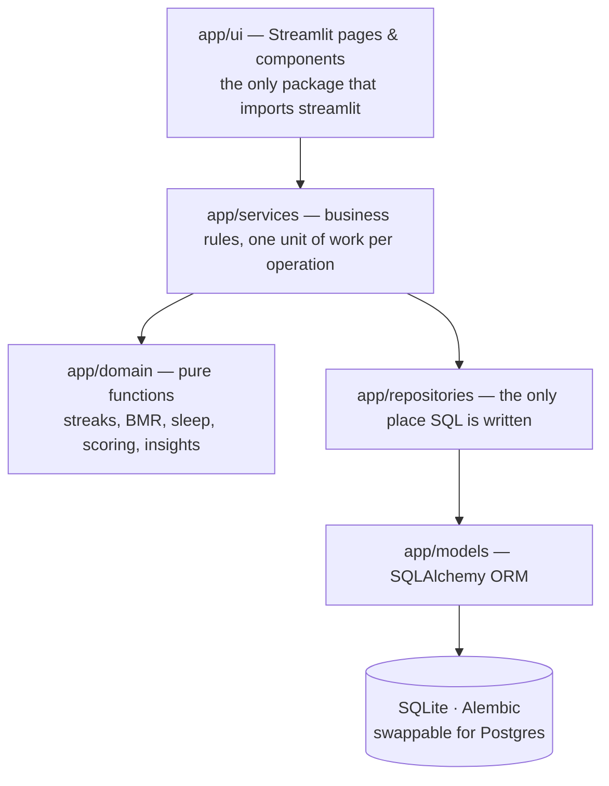

# Personal Habit & Daily Life Tracker

A local-first personal operating system: tasks, habits, sleep, activity, time,
goals, journal, health metrics and the analytics that connect them — built as a
modular Python application with Streamlit as a *replaceable* presentation layer.

Everything stays on your machine. Nothing is sent anywhere.

---

## What it answers

The product exists to answer three questions every day.

| Question | Where |
|---|---|
| **What did I do?** | Dashboard, Tasks, Habits, Activities |
| **How did I spend my time?** | Timeline, Time tracking, allocation charts |
| **Am I improving?** | Analytics, streaks, weekly review, calendar heatmap |

The design constraint behind all of it: **tracking must take less time than the
activity being tracked**. Hence Quick Add on the dashboard, one-tap habit ticks,
duration presets, and a morning check-in that fits in under a minute.

---

## Architecture



Two rules hold everywhere, and the test suite and linter both enforce parts of
them:

* **Nothing below `app/ui` imports Streamlit.** The services and the domain do
  not know a browser exists, which is what would let a FastAPI process reuse
  them unchanged.
* **Nothing in `app/domain` imports SQLAlchemy.** The streak engine, the BMR
  formulas, the sleep arithmetic and the productivity score are plain functions
  over plain values, so they are fast, reusable, and testable without a
  database.

### The layers

| Package | Responsibility |
|---|---|
| `app/config` | Environment-driven settings, validated by pydantic |
| `app/core` | Errors, logging, timezone-aware date handling |
| `app/database` | Engine, session, declarative base, custom column types, migrations |
| `app/models` | ORM tables, enums, constraints, indexes |
| `app/schemas` | Pydantic DTOs — the contract between the UI and the services |
| `app/domain` | Pure business logic, organised by subject area |
| `app/repositories` | Persistence: bounded, indexed, aggregated queries |
| `app/services` | Business rules, transactions, orchestration |
| `app/notifications` | Reminder delivery behind an interface (no implementation wired yet) |
| `app/export` | CSV / JSON / Excel serialisers |
| `app/ui` | Streamlit pages and reusable components |

> On the brief's suggested tree: it lists `domain/`, `calculations/` *and*
> `analytics/`, which would put the same pure functions in three places. They
> live in `app/domain/<subject>/` instead — one home per subject area, with the
> separation of concerns intact. `docs/architecture.md` maps the brief's names
> onto the modules that implement them.

---

## Features

**Daily** — dashboard with an explainable score, Quick Add, chronological
timeline, morning check-in, evening review.

**Tracking** — tasks (priorities, recurrence, estimates vs actuals), habits
(five types, four comparison directions, rest days, flexible weekly quotas),
sleep (correct across midnight), activities, time tracking.

**Analysis** — streaks, GitHub-style calendar heatmap, weekly review with
period-on-period comparison, monthly trends, rule-based insights and
recommendations, weekly numeric goals fed by the daily records.

**Health** — BMR by three configurable formulas, TDEE, BMI, weight trend. Every
figure is labelled an estimate, because that is what it is.

**Data** — CSV, JSON and Excel export; CSV/JSON import; full JSON backup and
restore; a SQLite file copy taken through SQLite's own backup API.

---

## Installation

Requires **Python 3.12+**.

```bash
python -m venv .venv
.venv\Scripts\activate        # Windows
source .venv/bin/activate     # macOS / Linux

pip install -e ".[dev]"
```

### Environment configuration

Every setting is optional; the defaults work out of the box.

```bash
cp .env.example .env
```

| Variable | Default | Meaning |
|---|---|---|
| `HABIT_APP_ENV` | `development` | `development` / `testing` / `production` |
| `HABIT_DATABASE_URL` | `sqlite:///data/habit_tracker.db` | Any SQLAlchemy URL |
| `HABIT_LOG_LEVEL` | `INFO` | Root level for the application logger |
| `HABIT_LOG_DIR` | `logs` | Where `habit_tracker.log` is written |
| `HABIT_TIMEZONE` | `Asia/Kolkata` | Fallback day boundary before a profile exists |
| `HABIT_DB_ECHO` | `false` | Echo SQL into the log |
| `HABIT_MAX_UPLOAD_MB` | `10` | Cap on imported files |

`.env` is git-ignored. No secret is ever read from source.

### Database setup

Nothing to do — the app runs `alembic upgrade head` on start. To do it by hand:

```bash
alembic upgrade head                              # apply migrations
alembic revision --autogenerate -m "add a thing"  # after changing a model
ruff format app/database/migrations/versions      # tidy the generated file
alembic downgrade -1                              # step back
```

### Running locally

```bash
streamlit run app/main.py
```

Then open <http://localhost:8501>.

### Seeding demo data

The dashboard is far more useful with history behind it:

```bash
python scripts/seed_data.py --days 90 --yes
```

Ninety days of deliberately *imperfect* data — bad Wednesdays, a habit that
slides, skipped days — because a demo dataset at 100% tells you nothing about
whether the analytics work.

---

## Development

```bash
ruff check .            # lint
ruff format .           # format
mypy                    # type-check app, scripts and tests
pytest                  # the whole suite
pytest -m "not slow"    # skip the 100k-row performance tests
pytest --cov=app        # with coverage
pre-commit install      # run all of the above on every commit
```

The suite is 451 tests at ~91% statement coverage of `app`, split into:

* **unit** — the domain layer, with no database at all
* **integration** — services against a temporary SQLite file and a frozen clock
* **UI smoke** — every page rendered headlessly through Streamlit's `AppTest`
* **performance** (`-m slow`) — 100,000 tasks and 100,000 habit logs, asserting
  both wall-clock budgets and the *number of queries issued*

### Backup

```bash
python scripts/backup.py                 # SQLite copy + JSON export
python scripts/backup.py --json-only
python scripts/backup.py --keep 5
```

Two artefacts because they fail differently: the file copy restores exactly but
only this app can read it; the JSON is portable and diffable but comes back as a
re-import.

### Export / import

From **Settings → Data**, or programmatically:

```python
from app.bootstrap import build_container

container = build_container()
container.exports.export_csv("habit_logs")
container.exports.full_backup()
container.imports.import_csv("sleep_records", uploaded_bytes)
```

Imports go through the same validated schemas the forms use, so an import
cannot create a record you could not have typed by hand.

---

## Deployment

The app is designed to run locally, and `.streamlit/config.toml` binds it to
`localhost` with usage statistics off. To run it elsewhere:

```bash
HABIT_APP_ENV=production HABIT_DATABASE_URL=postgresql+psycopg://... \
  streamlit run app/main.py --server.port 8501
```

The data is personal. If it leaves your machine, put authentication in front of
it first — see the roadmap.

---

## Documentation

| Document | Contents |
|---|---|
| [docs/architecture.md](docs/architecture.md) | Layers, dependency rules, key decisions and their trade-offs |
| [docs/database.md](docs/database.md) | Schema, constraints, indexes, migrations |
| [docs/development.md](docs/development.md) | Conventions, adding a feature end to end, tooling |
| [docs/testing.md](docs/testing.md) | Strategy, fixtures, what is covered and what is not |
| [docs/roadmap.md](docs/roadmap.md) | Extension points and what would come next |
| [docs/vibe_coding_brief.md](docs/vibe_coding_brief.md) | The original CLI exercise this folder started as |

---

## Licence

MIT — see [LICENSE](LICENSE).
