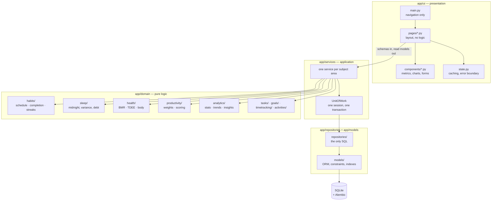

# Architecture

## The shape



## The two dependency rules

**1. Only `app/ui` imports Streamlit.**

The proof is `app/cli/`: a whole second front end, added after everything else
was written, needing **zero** changes to any service, repository or domain
module. If a business rule had leaked into a Streamlit page, the CLI would have
had to reimplement it.

Verify it:

```bash
grep -rn "import streamlit" app --include="*.py" | grep -v "^app/ui/" | grep -v "^app/main.py"
```

That is what makes the presentation layer replaceable. A FastAPI process would
call `build_container()` and use the same services; so would a CLI, a scheduled
job, or a test.

**2. Nothing in `app/domain` imports SQLAlchemy.**

```bash
grep -rn "sqlalchemy" app/domain --include="*.py"
```

The domain layer takes plain values and returns plain values. The streak engine
does not know what a row is, which is why every one of its edge cases — a rest
day, a habit that started on Tuesday, a completion on a day the habit was not
due — is a three-line unit test rather than a fixture.

## Where the brief's names live

The brief's suggested tree lists `domain/`, `calculations/` and `analytics/` as
three separate packages. Implementing all three would put the same pure
functions in three places. They are consolidated into `app/domain/<subject>/`:

| Brief | Module |
|---|---|
| `calculations/bmr.py` | `app/domain/health/bmr.py` |
| `calculations/tdee.py` | `app/domain/health/tdee.py` |
| `calculations/streaks.py` | `app/domain/habits/streaks.py` |
| `calculations/productivity.py` | `app/domain/productivity/scoring.py` |
| `calculations/statistics.py` | `app/domain/analytics/statistics.py` |
| `analytics/trends.py` | `app/domain/analytics/trends.py` |
| `analytics/insights.py` | `app/domain/analytics/insights.py` |
| `analytics/aggregations.py` | `app/domain/analytics/aggregations.py` |

Everything else in the brief's tree exists at the path it names.

## Decisions worth defending

### Time is stored in UTC; days are local

Every `datetime` crossing a layer boundary is timezone-aware UTC. Every *day* —
a habit log date, a task due date, the date a night's sleep is filed under — is
a naive `date` in the user's timezone.

Days are a human concept and UTC is a storage concept, so the two are different
types and the conversion happens in exactly one module,
`app/core/timeutils.py`. `day_bounds_utc` computes a day's end as "the start of
the next local day" rather than "start + 24 hours", which is why a
daylight-saving day comes out as 23 or 25 hours and not silently wrong.

### Sleep never sees a clock time

A night is a pair of instants, not two clock readings. `resolve_sleep_window`
turns "23:30 → 06:30" into two datetimes seven hours apart *once*, at the edge,
and every calculation downstream is ordinary subtraction. No function below
that one needs a branch for "the wake time is smaller than the bedtime".

The single place the wall clock genuinely matters — "is my bedtime drifting?" —
uses a midday-centred axis, so 23:50 and 00:10 are twenty minutes apart rather
than twenty-three hours and forty.

### Streaks read as few rows as they can

Two calculations with different data needs:

* `current_streak` consumes a **lazy, descending** iterator of completion dates
  and abandons it at the first gap. `HabitRepository.iter_completed_dates_desc`
  backs it with a paged query, so a four-year habit with a two-day streak
  costs one query of 64 rows. A unit test asserts the iterator is not drained.
* `longest_streak` genuinely needs every completion — but only the *date column*
  of one habit, which `ix_habit_log_habit_date` can serve without touching the
  table.

### The productivity score is explainable and honest about gaps

`score_day` returns a `ProductivityScore` carrying every component, its weight,
what it achieved and the points it contributed — so the UI prints the
arithmetic instead of a mystery number.

Components with no data are *dropped* and the remaining weights rescaled over
what is known. A user who does not track exercise is not punished for exercise.
The result reports `coverage` and a `skipped` list, so a 90 built from two
inputs cannot masquerade as a 90 built from six. The weights themselves live in
one validated pydantic model persisted in `app_settings` — there is no
hard-coded 0.25 anywhere else in the codebase.

### Categories are data, not code

"Cricket" is a `Category` row of kind `ACTIVITY`. So is "Studying", of kind
`TIME`, with `is_productive = true`. One table with a `kind` discriminator
covers tasks, habits, activities and time entries, so adding a sport or
renaming a category is a user action, not a deployment. The only place a
category *name* appears in code is the seed list and the three dashboard tiles
that resolve a name to an id at the service boundary.

### Unit of work: closing beats rolling back

`UnitOfWork.__exit__` rolls back on an exception, and on an exit that left
uncommitted changes behind — but a read-only block is simply **closed**.

That distinction is load-bearing. `rollback()` expires every instance the
session loaded, so an ORM row read inside the block would raise
`DetachedInstanceError` the moment a caller touched it afterwards. `close()`
detaches the same rows but leaves their loaded values readable.

### Read models cross the boundary, never ORM rows

Services return pydantic read models. The UI never holds a mapped instance, so
it cannot trigger a lazy load on a closed session, and a Streamlit rerun cannot
resurrect a stale one.

### Multi-user is a migration, not a rewrite

Every user-owned table already carries `user_id`, indexed, and every scoped
repository filters on it. The application creates one profile and uses it.
Adding a second user is an insert plus an authentication layer, not a schema
change to fourteen tables.

## Query budget

The expensive pages are budgeted, and the budget is asserted by
`tests/integration/test_performance.py` against a 100,000-row database:

| Operation | Queries | How |
|---|---|---|
| Current streak, one habit | ≤ 6 | Paged descending dates, abandoned at the first gap |
| Time allocation, 90 days | ≤ 3 | One `GROUP BY` in the database |
| Count overdue tasks | ≤ 2 | `SELECT count(*)`, no rows fetched |
| Full dashboard | < 120 | Fixed cost; does not grow with habits or tasks |
| 365-day heatmap | < 60 | Grouped reads plus two bulk writes for missing scores |

`AnalyticsRepository.daily_aggregates` is the piece that makes the last two
possible: eight grouped queries covering a whole date range, whatever its
length, instead of a loop asking each repository once per day.

## Error handling

```
Exception
└── AppError                 carries message, structured details, user_hint
    ├── ValidationError      a business rule rejected the input
    ├── NotFoundError        no such record, or not owned
    ├── ConflictError        duplicate habit, second log for a day, overlap
    ├── DatabaseError        the database refused or is unreachable
    ├── ConfigurationError   the app cannot start correctly
    ├── DataImportError      unreadable or invalid import file
    └── DataExportError      an export could not be produced
```

Every error carries two messages: `message` plus `details` for the log, and
`user_message()` for the screen. `app/ui/state.py` holds the only two places an
exception reaches a user — `error_boundary` and `run_action` — and neither one
ever shows a traceback.

The import/export errors are deliberately *not* named `ImportError` and
`ExportError`: defining a class called `ImportError` shadows the builtin in
every module that imports it, which turns an unrelated failed import into a
baffling bug report.

## Extension points

| Want to add | Do this |
|---|---|
| Another front end | What `app/cli/` did: call `build_container()`, use the services |
| A REST API | Call `build_container()`; the services are already framework-free |
| PostgreSQL | Change `HABIT_DATABASE_URL`; the schema is portable, migrations run as-is |
| Reminders | Implement `NotificationService`, pass it to `build_container()` |
| An AI coach | Implement `PersonalCoach`; the rule-based one stays as the offline default |
| A new insight | One pure function in `app/domain/analytics/insights.py`, added to the rule tuple |
| A new habit type | One member of `HabitType`, one branch in `evaluate()` |
