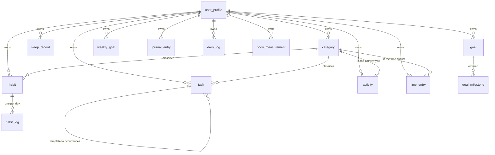

# Database

SQLite by default, through SQLAlchemy 2.0 with fully typed `Mapped[]` models.
Nothing in the schema is SQLite-specific, so `HABIT_DATABASE_URL` can point at
PostgreSQL and the same migrations apply.

## Schema



Fifteen tables. `app_settings` is the sixteenth and stands alone: a key/value
store for configuration a user can change at runtime.

## Tables

| Table | Holds | Key constraint |
|---|---|---|
| `user_profile` | The person, their targets, timezone and BMR formula | height 50–280 cm, week start 0–6 |
| `category` | Configurable labels for four features | unique `(user_id, kind, name)` |
| `task` | One thing to do; templates spawn occurrences | non-negative durations, interval ≥ 1 |
| `habit` | A repeated behaviour and its definition of done | unique `(user_id, name)`, end ≥ start |
| `habit_log` | One habit, one day | **unique `(habit_id, log_date)`** |
| `sleep_record` | One night, filed under the wake date | unique `(user_id, log_date)`, wake > sleep, 0 < duration ≤ 1440 |
| `activity` | A bout of exercise or sport | duration > 0, end > start |
| `time_entry` | A block of tracked time | duration > 0, end > start |
| `goal` | Something worked towards | progress 0–100, target ≥ start |
| `goal_milestone` | A checkpoint | ordered by `sort_order` |
| `weekly_goal` | A numeric weekly target | unique `(user_id, week_start, metric)` |
| `journal_entry` | How the day felt | unique `(user_id, entry_date)`, every rating 1–10 |
| `daily_log` | Morning plan, evening verdict, cached score | unique `(user_id, log_date)`, score 0–100 |
| `body_measurement` | A weigh-in | unique `(user_id, measured_on)`, weight 0–500 |
| `app_settings` | Runtime configuration | unique `key` |

## Data-integrity rules, and where they live

The brief's rules are enforced in the *database*, not only in the UI — because
the UI is not the only writer, and an import or a script must obey them too.

| Rule | Enforced by |
|---|---|
| No two habit logs for the same habit and day | `uq_habit_log_habit_date` |
| No impossible sleep duration | `ck_sleep_record_duration_plausible`, plus a narrower domain range |
| Goal progress stays within 0–100 | `ck_goal_progress_range` and `validate_progress` |
| Only legal task status transitions | `ALLOWED_TRANSITIONS` in the domain layer |
| Ratings stay within 1–10 | `CHECK` on every rating column |
| No duplicate habit names | `uq_habit_user_name`, checked first for a readable error |
| No overlapping time entries | `find_overlap`, when the user turns the setting on |
| History is preserved | Habits archive rather than delete; deleting is behind a confirmation |

## Indexes

Named explicitly through the metadata naming convention, so Alembic can alter
them later. Anything SQLite invents anonymously cannot be dropped without
rebuilding the table.

| Index | Serves |
|---|---|
| `ix_task_user_status_due` | "What is open today" — the dashboard's most frequent question |
| `ix_task_user_due` | Date-range task queries |
| `ix_task_user_completed_at` | Completion history |
| `ix_habit_log_habit_date` | The streak walk, index-only |
| `ix_habit_log_date_completed` | Cross-habit daily counts for the heatmap |
| `ix_sleep_record_user_date` | Sleep ranges and averages |
| `ix_time_entry_user_date` | Daily and range time totals |
| `ix_time_entry_user_category_date` | Per-category totals |
| `ix_time_entry_user_started` | Overlap detection |
| `ix_activity_user_date`, `ix_activity_user_category_date` | Activity ranges |
| `ix_goal_user_status`, `ix_goal_user_target_date` | Open goals, soonest first |
| `ix_daily_log_user_date` | The cached-score reads behind the heatmap |
| `ix_journal_entry_user_date` | Journal ranges |

Every `user_id` and every `created_at` is indexed by the mixins that define
them.

## Custom column types

`app/database/types.py`:

* **`UTCDateTime`** — SQLite has no timezone-aware datetime type, so
  `DateTime(timezone=True)` hands back a *naive* value and comparing it to an
  aware one raises `TypeError` a long way from the cause. This `TypeDecorator`
  normalises to UTC on the way in and re-attaches UTC on the way out.
* **`str_enum`** — SQLAlchemy stores an `Enum` by member *name* by default.
  These are `StrEnum`s whose value is already the readable form, so the column
  persists the value. Non-native enums with a `CHECK` constraint keep SQLite
  and PostgreSQL behaving identically.

## Connection settings

`_configure_sqlite` applies four pragmas on every connection:

| Pragma | Why |
|---|---|
| `foreign_keys=ON` | Off by default in SQLite, which silently turns every `ON DELETE CASCADE` into a no-op |
| `journal_mode=WAL` | Lets the UI read while a write is in flight |
| `synchronous=NORMAL` | Sensible durability for a local single-user app under WAL |
| `busy_timeout=5000` | Waits for a competing writer instead of failing immediately |

## Migrations

Alembic, configured so the URL comes from `app.config.settings` and never from
`alembic.ini` — the app and the migrations cannot disagree about which database
they are pointed at.

```bash
alembic upgrade head
alembic revision --autogenerate -m "describe the change"
ruff format app/database/migrations/versions
alembic downgrade -1
alembic history
```

`render_as_batch=True` is on, because SQLite cannot `ALTER` a column and Alembic
has to rebuild the table instead. Without it the second schema change of this
project's life would fail.

`app.bootstrap.ensure_schema` runs `alembic upgrade head` on start, and falls
back to `create_all` only when the migration environment is unavailable — which
happens in a test using an in-memory database, and should not happen anywhere
else. `tests/integration/test_data.py::TestMigrations` asserts the migrated
schema matches the models exactly.

## Growth

The tables that grow with use are `habit_log`, `task`, `time_entry` and
`activity`. Every read of them is either aggregated in the database
(`GROUP BY`, `SUM`, `AVG`, `count`) or bounded by a date range and a page.
There is deliberately no "list every task" method on the repository.

`tests/integration/test_performance.py` builds 100,000 tasks, 100,000 habit
logs and 50,000 time entries, then asserts wall-clock budgets *and* query
counts — the latter being what actually catches a regression, since a
full-table scan on a laptop SSD can still look fast.
